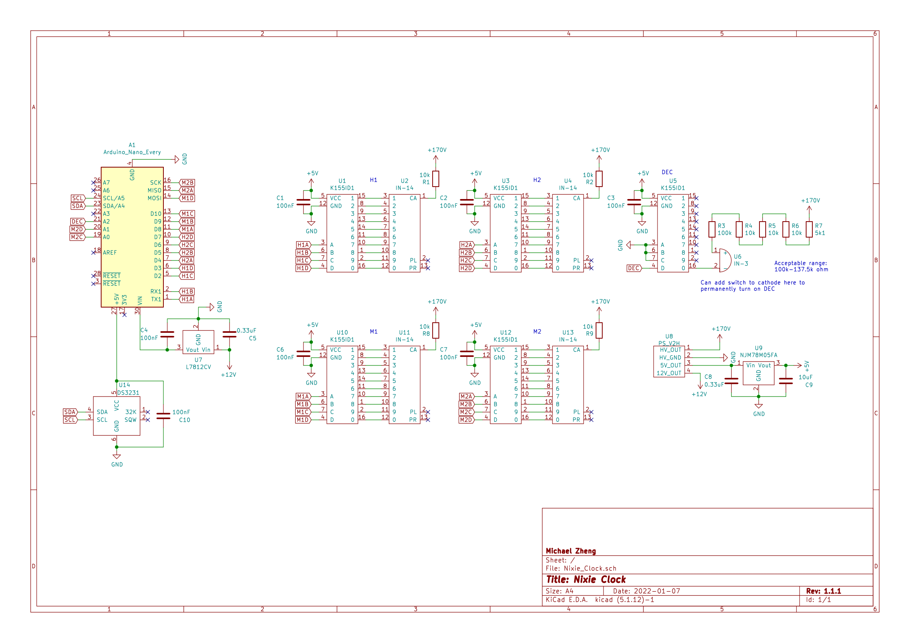
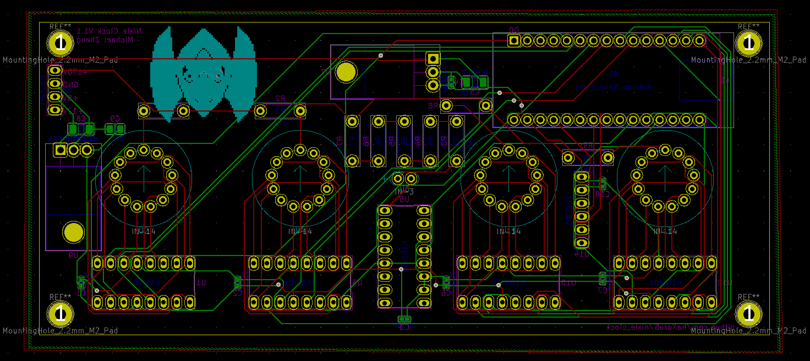
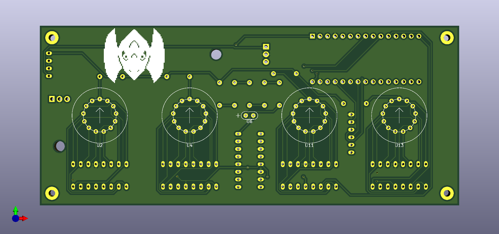
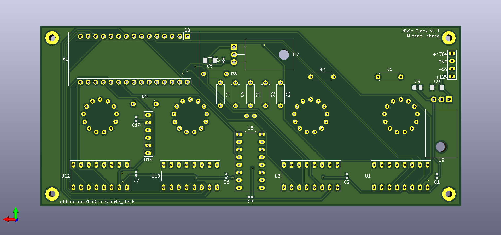
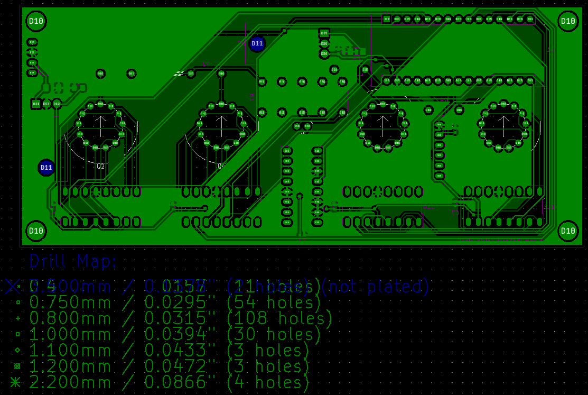

# Nixie Clock

## Warning, Nixie Tubes require high voltages, use caution when handling

Retro style clock built using an Arduino and IN-14 Nixie tubes

## Intro
Nixie tubes are a type of cold cathode display. They were used as numerical displays as a precursor to seven-segment displays. This project uses old Soviet IN-14 tubes to make a clock. I used KiCad 5 to design the PCB, according to JLCPCB specifications. Although this is not an in depth build guide, feel free to use this as a reference for your own nixie projects.

### Key Components
#### Nixie Tubes
IN-14 tubes were used to display digits and IN-3 tubes were used as a decimal point and blinks to indicate seconds. Nixie tubes require very high voltages, so a custom power supply was required. Resistors were used to drop the voltage and current to the appropriate levels for each tube according to their datasheets.
#### Power Supply
The nixie tubes require high voltages, so a high voltage DC-DC converter was required to step up the voltage.
#### BCD Decoder IC
Due to the high voltage, specialty BCD decoders were required to drive the nixie tubes. Additionally, they are used to isolate the high voltages from the other components. They operate by connecting the cathode to ground to turn the appropriate digit on.
#### Real Time Clock
A battery powered Real Time Clock (RTC) is used to keep the time, even if the clock is powered off.
#### Arduino
The Arduino is the controlling module and the brain to the clock. It translates the clock information sent by the RTC and instructs the ICs to display the correct time.
## Schematic
The schematic was created as follows. Custom symbols were created for several components. The library containing all components is included in this repository [here](https://github.com/haXoru5/nixie_clock/tree/main/Nixie_KiCad). Several filter capacitors were used in this design. Voltage regulators were connected to the +12V and +5V outputs to ensure a constant voltage. (This is not required for the +170V output as the nixie tubes have a generous operating voltage range). Filter capacitors were also used to reduce ripple. Ripple may cause components to misbehave, and is best practice to mitigate it as much as possible. 0.33µF capacitors were used according to the voltage regulator datasheets. Generally, one 100nF capacitor is connected in parallel with each IC to reduce high frequency noise. another 10µF capacitor was used at the +5V output to reduce low frequency noise.

## PCB
After the schematic is created, I assigned footprints to the symbols and generated a netlist.
The netlist was used to create a ratsnest which could be used to create the PCB. I put all parts apart from the nixie tubes on the back side to ease mounting and presentation in the future. Mounting holes are also drilled to mount the PCB to its housing. Apart from the nixie tubes, all parts were standard sizes and had footprints already available in the KiCad footprint libraries. The custom footprints can be found in this repository [here](https://github.com/haXoru5/nixie_clock/tree/main/Nixie_KiCad). Note that due to the high voltages, trace clearance must be increased to 0.4mm. Track width can remain the same as current is not too high. Note that depending on the PCB manufacturer, additional default settings in Pcpnew may need to be adjusted.

## Housing
WIP
## Arduino Code
WIP
## Production
### Gerbers
Generating Gerber and drill files may depend on the PCB manufacturer. As I ordered my PCB from JLCPCB, I used [their specifications](https://support.jlcpcb.com/article/149-how-to-generate-gerber-and-drill-files-in-kicad).

### Parts
The parts I used were sourced from a variety of suppliers. For a comprehensive parts list, refer to [the BOM](https://github.com/haXoru5/nixie_clock/blob/main/BOM.csv).
**Ebay**
IN-14 Nixie Tube
IN-3 Nixie Tube
High Voltage Power Supply
K155ID1 BCD Decoder IC
**Aliexpress**
DS3231 RTC
DIP Sockets
Female PCB Headers
**DigiKey**
L7812CV 12V Voltage Regulator
NJM78M05FA 5V Voltage Regulator
1/4W THT Resistors
SMT Capacitors
**Amazon**
Arduino Nano Every
### Assembly
WIP

### Future Releases
#### V2.0
- Programmable alarm function
